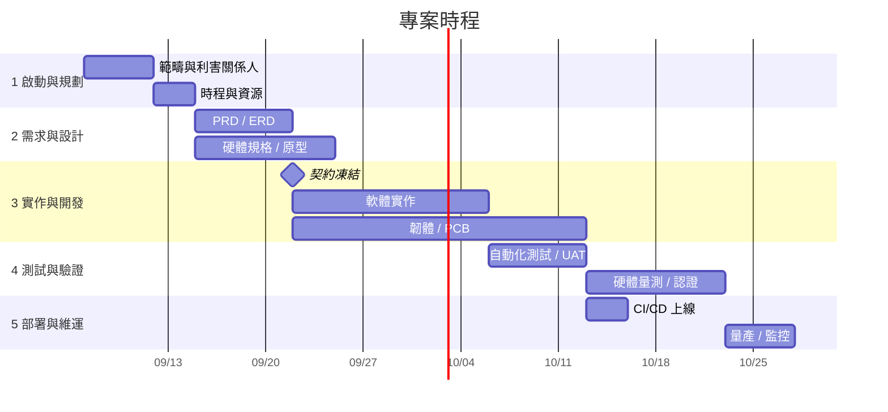

# 專案時程表

> 使用 Mermaid gantt，可版控、可被工具渲染。

```mermaid
gantt
    title 專案時程
    dateFormat  YYYY-MM-DD
    axisFormat  %m/%d

    section 1 啟動與規劃
    範疇與利害關係人      :a1, 2026-09-07, 5d
    時程與資源            :a2, after a1, 3d

    section 2 需求與設計
    PRD / ERD             :b1, after a2, 7d
    硬體規格 / 原型        :b2, after a2, 10d

    section 3 實作與開發
    契約凍結              :milestone, m1, after b1, 0d
    軟體實作              :c1, after m1, 14d
    韌體 / PCB            :c2, after m1, 21d

    section 4 測試與驗證
    自動化測試 / UAT       :d1, after c1, 7d
    硬體量測 / 認證        :d2, after c2, 10d

    section 5 部署與維運
    CI/CD 上線            :e1, after d1, 3d
    量產 / 監控           :e2, after d2, 5d
```
