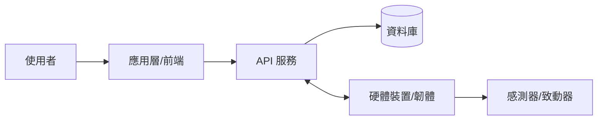
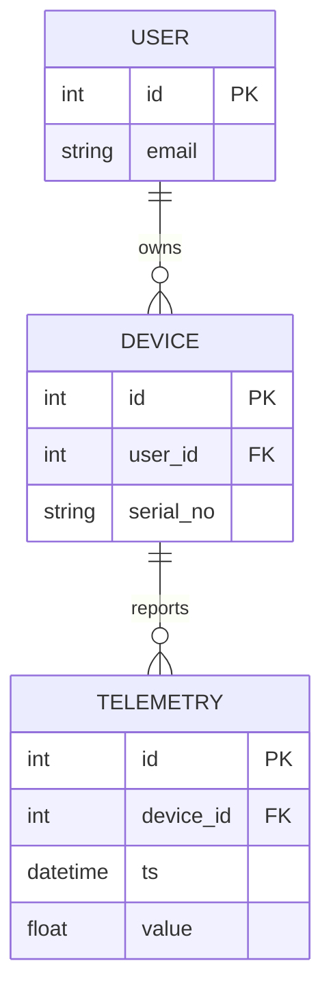

# 工程要求文件 (ERD) — 結構層

> 把 PRD 的意圖轉成技術結構。這裡的內容應與 `02_contracts/` 完全一致。

## 1. 系統架構總覽

## 2. 軟硬體邊界 (Interface Contract)
> 軟體與硬體之間怎麼溝通？這是整合專案最容易出錯的地方，務必寫清楚。

| 介面 | 方向 | 協定 | 資料格式 | 契約檔 |
|------|------|------|----------|--------|
| 例：裝置狀態上報 | HW → API | MQTT/HTTP/UART | JSON/binary | `02_contracts/api.openapi.yaml` |
| 例：韌體指令下發 | API → HW | 同上 | 同上 |  |

## 3. 資料模型 (ER Diagram)

> 對應的可執行 schema 在 `02_contracts/data-schema.sql`。

## 4. 技術選型 (對應 ADR)
| 項目 | 選擇 | 決策紀錄 |
|------|------|----------|
| 後端語言/框架 |  | ADR-0002 |
| 資料庫 |  |  |
| MCU / 硬體平台 |  |  |
| 通訊協定 |  |  |

## 5. 需求追溯 (Traceability)
| PRD 需求 | 對應模組/元件 | 對應契約 | 對應測試 |
|----------|---------------|----------|----------|
| FR-001 |  |  | AC-001 |
