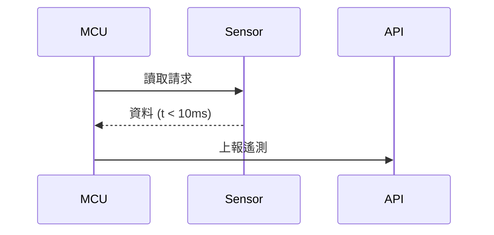

# 時序規格 (Timing)

> 描述通訊時序、時脈、延遲需求。韌體的 delay/timeout 設定必須符合此規格。

## 通訊時序
| 訊號/匯流排 | 參數 | 最小 | 典型 | 最大 | 單位 | 說明 |
|-------------|------|------|------|------|------|------|
| I2C | SCL 頻率 |  | 400 |  | kHz |  |
| UART | Baud |  | 115200 |  | bps |  |

## 關鍵時序需求
- 開機到就緒 (boot ready)：< ___ ms（對應 NFR-___）
- 感測取樣週期：___ ms
- Watchdog timeout：___ ms

## 時序圖 (可選)

