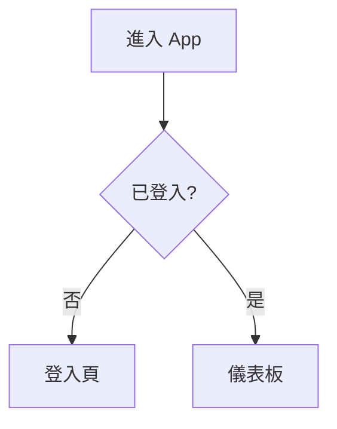

# UI/UX 原型

放置線框圖、原型連結與互動說明。為了可版控與可重建，建議：

- **低保真線框**：直接用 Mermaid 或 ASCII 佈局描述於此。
- **高保真設計**：放 Figma 連結，並在此以文字描述關鍵畫面、狀態與流程，
  讓「沒有 Figma 存取權時也能依文字重建 UI」。

## 畫面清單
| 畫面 ID | 名稱 | 對應需求 | 說明/連結 |
|---------|------|----------|-----------|
| UI-001 | 首頁 | FR-001 |  |

## 關鍵流程

