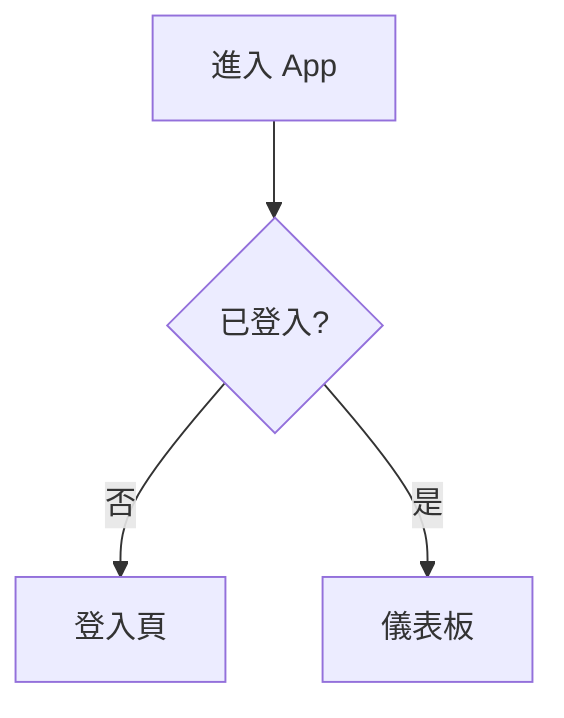

# UI/UX 原型

放置線框圖、原型連結與互動說明。為了可版控與可重建，建議：

- **低保真線框**：直接用 Mermaid 或 ASCII 佈局描述於此。
- **高保真設計**：放 Figma 連結，並在此以文字描述關鍵畫面、狀態與流程，
  讓「沒有 Figma 存取權時也能依文字重建 UI」。

## UI 文字集中與多語（建議樣式）
- **所有畫面文字集中到單一文字表**（如 `strings` / 翻譯表），由一個 `retranslate()` 統一套用，避免某段文字只在建構時設定而漏改。
  即使一開始只有單一語言，集中文字表也讓之後加語言幾乎零成本。
- **完整性測試**：各語言的鍵一致；切到某語言時畫面上**無殘留其他語言**文字。
- **GUI 冒煙測試**：以 offscreen 模式執行，並使用**隔離的設定檔**，不污染使用者真正的偏好設定。

## 畫面清單
| 畫面 ID | 名稱 | 對應需求 | 說明/連結 |
|---------|------|----------|-----------|
| UI-001 | 首頁 | FR-001 |  |

## 關鍵流程

